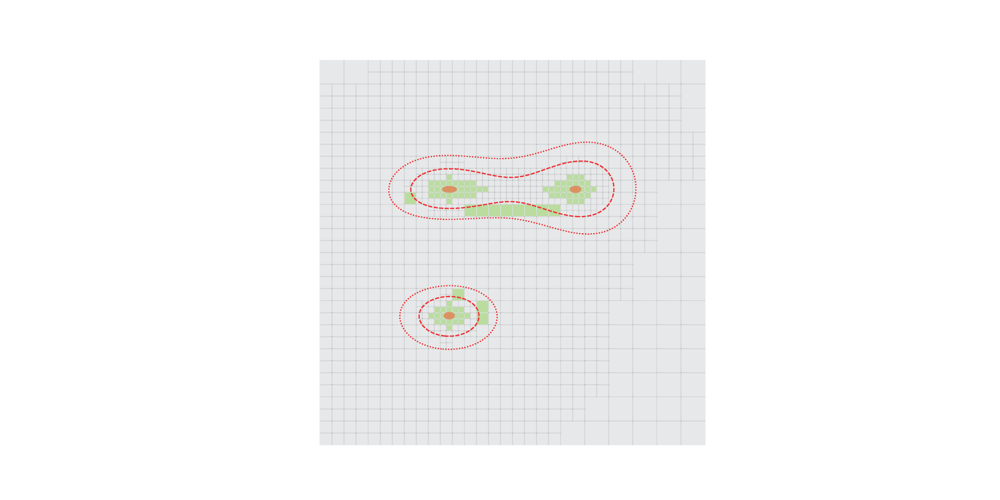

# Grid is Good



This repository contains codes used in the experiments of the [paper](https://arxiv.org/pdf/2301.07555)
```
@article{flinth2025grid
  title={Grid is Good: Adaptive Refinement Algorithms for Off-the-Grid Total Variation Minimization},
  author={Axel Flinth, Frédéric de Gournay and Pierre Weiss},
  journal={OJMO},
  year={2025}
  note={In press}
}
```

It is mainly released for transparency and reproducibility purposes. Should you find this code useful for your research, please cite the above paper.

## Required packages
The package requires [numpy](https://numpy.org/) and [cvxpy](https://www.cvxpy.org/) to be installed.

## Running experiments
The experiments in 1d and 2d, both with and without gradient-based refinement rules, are performed by running the scripts `1d_tests.py` and `2d_tests.py`, respectively.

``` 
python 1d_tests.py
python 2d_tests.py
```


